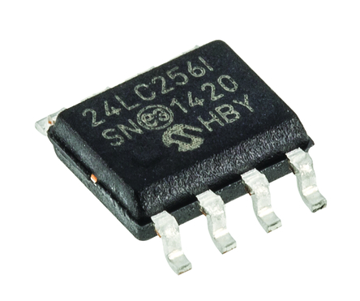

<center>


Created by Ouroboros Embedded Education.
</center>

# EEPROM C Library Documentation

<center></center>

This documentation describes the `eeprom` C library, which provides a hardware-agnostic interface for reading and writing to I2C EEPROM devices. The library is designed for embedded systems and supports configurable memory size, page size, and address width, with user-supplied functions for I2C and timing.

---

## Table of Contents

- [EEPROM C Library Documentation](#eeprom-c-library-documentation)
  - [Table of Contents](#table-of-contents)
  - [Overview](#overview)
  - [Features](#features)
  - [File Structure](#file-structure)
  - [Data Structures](#data-structures)
    - [`eeprom_t`](#eeprom_t)
  - [Enumerations](#enumerations)
    - [`eeprom_e`](#eeprom_e)
  - [API Reference](#api-reference)
    - [Initialization](#initialization)
    - [Write](#write)
    - [Read](#read)
    - [Fill All](#fill-all)
  - [Usage Example](#usage-example)
  - [Notes](#notes)
  - [License](#license)

---

## Overview

The `eeprom` library abstracts the process of reading from and writing to I2C EEPROM memory devices. It supports any EEPROM with configurable memory and page size, and is independent of the underlying microcontroller or I2C implementation.

---

## Features

- Hardware-independent (user provides I2C read/write and delay functions)
- Supports arbitrary EEPROM memory size, page size, and address width
- Handles page boundaries automatically during writes
- Provides functions for initialization, read, write, and filling the entire memory
- Robust error checking and state management

---

## File Structure

- **eeprom.h** – Public API, data structures, and macros
- **eeprom.c** – Implementation of all functions

---

## Data Structures

### `eeprom_t`

```c
typedef struct {
    uint32_t memSize;         // EEPROM total size in bytes
    uint32_t pageSize;        // EEPROM page size in bytes
    uint8_t  memAddrSize;     // EEPROM memory address size in bytes (1 or 2)
    uint8_t  i2cAddress;      // I2C address of the EEPROM
    ee_write_fxn EeWriteFxn;  // User-supplied I2C write function
    ee_read_fxn  EeReadFxn;   // User-supplied I2C read function
    delay_ms     DelayMs;     // User-supplied delay function (ms)
    struct {
        uint32_t actAddress;  // Last accessed address
        uint8_t  initialized; // Initialization flag
    } _intern;
} eeprom_t;
```


---

## Enumerations

### `eeprom_e`

```c
typedef enum {
    EE_OK,
    EE_ERROR,
    EE_NOT_INITIALIZED,
    EE_INVALID_VARS,
    EE_OVERFLOW,
    EE_UNKNOWN = 0xFF
} eeprom_e;
```


---

## API Reference

### Initialization

```c
eeprom_e eeprom_init(eeprom_t *Eeprom);
```

- Initializes the EEPROM structure and checks user function pointers and parameters.
- Returns `EE_OK` on success.

---

### Write

```c
eeprom_e eeprom_write(eeprom_t *Eeprom, uint32_t Address, uint8_t *data, uint32_t len);
```

- Writes `len` bytes from `data` to EEPROM starting at `Address`.
- Handles page boundaries automatically.
- Returns `EE_OK` on success, `EE_OVERFLOW` if out of bounds.

---

### Read

```c
eeprom_e eeprom_read(eeprom_t *Eeprom, uint32_t Address, uint8_t *data, uint32_t len);
```

- Reads `len` bytes from EEPROM starting at `Address` into `data`.
- Returns `EE_OK` on success, `EE_OVERFLOW` if out of bounds.

---

### Fill All

```c
eeprom_e eeprom_fill_all(eeprom_t *Eeprom, uint8_t fillByte);
```

- Fills the entire EEPROM with `fillByte`.
- Returns `EE_OK` on success.

---

## Usage Example

```c
#include "eeprom.h"

// User must implement these functions for their hardware:
eeprom_e my_eeprom_write(uint32_t i2cAddr, uint32_t memAddr, uint8_t memAddrSize, uint8_t *data, uint32_t len);
eeprom_e my_eeprom_read(uint32_t i2cAddr, uint32_t memAddr, uint8_t memAddrSize, uint8_t *data, uint32_t len);
void my_delay_ms(uint32_t ms);

eeprom_t eeprom = {
    .memSize = 4096,          // 4KB EEPROM
    .pageSize = 32,           // 32 bytes per page
    .memAddrSize = 2,         // 2-byte memory address
    .i2cAddress = 0x50,       // Typical EEPROM I2C address
    .EeWriteFxn = my_eeprom_write,
    .EeReadFxn  = my_eeprom_read,
    .DelayMs    = my_delay_ms
};

void app_init(void) {
    if (eeprom_init(&eeprom) == EE_OK) {
        uint8_t data[^32] = {0xAA};
        eeprom_write(&eeprom, 0x0000, data, sizeof(data));
        eeprom_read(&eeprom, 0x0000, data, sizeof(data));
        eeprom_fill_all(&eeprom, 0xFF);
    }
}
```


---

## Notes

- The user must provide working I2C read/write and delay functions.
- The library automatically waits (`EEPROM_DELAY_BTW_WRITES`, default 8ms) between page writes.
- All operations check for out-of-bounds access and initialization state.
- Debug output is available if `EEPROM_DEBUG` is defined.

---

## License

See source files for license information.
Author: Pablo Jean (pablo-jean), February 2024

---

**For further details, refer to the code and comments in `eeprom.h` and `eeprom.c`.**